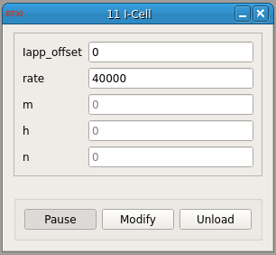

###I-Cell

**Requirements:** None  
**Limitations:** None  

<!--start-->
Module for a current-clamped cell. Uses a simple Runge-Kutta solver to compute voltages and is based on a module of unknown identity and unknown parameters.  
<!--end-->

####Input Channels
1. input(0) - Iapp (A) : input current

####Output Channels
1. output(0) - V (V) : output voltage

####Parameters
1. Iapp_offset - uA/cm^2 : current added to input
2. rate - Hz - integration rate (set to a multiple of your RT period for best results)

####States
1. m - Sodium Activation
2. h - Sodium Inactivation
3. n - Potassium Activation
